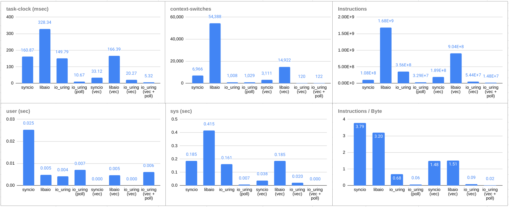
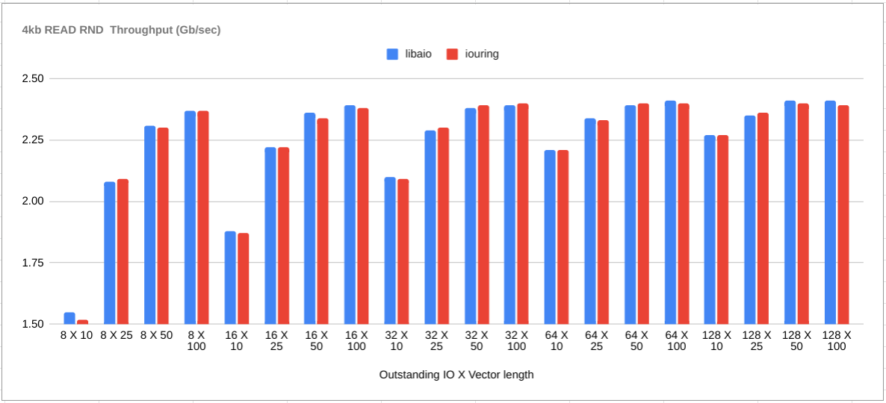

# dmlab - Benchmarking IO Operations

A benchmarking tool for comparing sync-io, libaio and io_uring performance
<br />
<br />

##### Prerequisites

- Linux Kernel version > 5.1
- libaio
- liburing

##### Installing libaio
`libaio` is a wrapper around the Linux `aio` library. Clone libaio from source and build it.

```shell
git clone https://pagure.io/libaio.git
cd libaio
make
```

##### Installing liburing
`liburing` is a wrapper around the Linux `io_uring` library. Clone liburing from source and build it.

```shell
git clone https://github.com/axboe/liburing.git
cd liburing
make
```

#### Build
Clone the repository, and make sure the prerequisite libs are organized as follows. Run `make` to build the application into `build/`.
```shell
(parent directory)
|
---dmlab/
|
---libaio/src
|
---liburing/src
```
Build tested with:

- g++ 9.3.0
- Linux kernel 5.4.0


#### Sample usage:

```shell
benchmark --file <file_name> --threads <thread_count> --bsize <block_size_kb> --op <read|write> --mode <seq|rand> --lib <syncio|libaio|liburing> --oio <outstanding_io_count> --vsize <vectored IO batch size> --nodirect (disable O_DIRECT) --debug (show_debug)
```
<br />

#### Benchmarks:

**Perf stats for 4kb RANDOM READ. Async Outstanding IO = 128. Vectored operation batch size = 10:**

<br />

**libaio vs io_uring at varying Outstanding IO Ops:**

<br />

**Vectored libaio vs io_uring at varying Outstanding IO Ops and Vector batch sizes:**

<br />

**syncio vs libaio vs io_uring at varying thread counts:**

<br />

**Vectored syncio vs libaio vs io_uring at varying thread counts:**

<br />

**Unbuffered io_uring (O_DIRECT enabled) vs Buffered io_uring (O_DIRECT disabled):**

<br />

